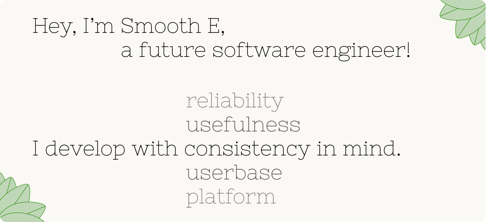

<picture>
    <source media="(prefers-color-scheme: light)" srcset="resources/hello-light.png">
    <source media="(prefers-color-scheme: dark)" srcset="resources/hello-dark.png">
    
</picture>

# Projects

<table>
    <tr>
        <th>Name</th>
        <th>Description</th>
        <th>Links</th>
    </tr>
    <tr>
        <td><a href="https://github.com/Smooth-E/wireless-adb-switch">WADBS</a></td>
        <td>
            An app that allows you to switch Android's Wireless Debugging feature on and off quickly. 
            It provides several widgets and a quick settings tile to do this.
        </td>
        <td align="center">
            <a href="https://github.com/Smooth-E/wireless-adb-switch">
                <picture>
                    <source media="(prefers-color-scheme: light)" srcset="resources/github-light.png">
                    <source media="(prefers-color-scheme: dark)" srcset="resources/github-dark.png">
                    
                </picture>
            </a>
             
            
        </td>
    </tr>
    <tr>
        <td><a href="https://zifirka.itch.io/it-wasnt-my-birthday">It wasn't my birthday</a></td>
        <td>
            A visual novel made for the <a href="https://itch.io/jam/sibgamejam-nov-2023">Siberian Game Jam</a> 
            in three days. This is actually my first game made in Godot. It is not translated to any language and is 
            only available in Russian as of now.
        </td>
        <td align="center">
            
        </td>
    </tr>
    <tr>
        <td><a href="https://smooth-e.itch.io/village-hero">Village Hero</a></td>
        <td>
            A game made for <a href="https://itch.io/jam/maxters-jam-2023">Maxter's Jam 2023</a> in three days.
            This is a 2D shooter-platformer with a custom A* based pathfinding system and cute visuals.
        </td>
        <td align="center">
            
        </td>
    </tr>
    <tr>
        <td><a href="https://github.com/Smooth-E/install-renderware">RenderWare installation guide</a></td>
        <td>
            A guide on how to install <a href="https://en.wikipedia.org/wiki/RenderWare">RenderWare</a> - a legendary 
            game engine from the past. It originates from the installer files on Web Archive and an issue with a not so 
            obvious fix.
        </td>
        <td align="center">
            <a href="https://github.com/Smooth-E/wireless-adb-switch">
                <picture>
                    <source media="(prefers-color-scheme: light)" srcset="resources/github-light.png">
                    <source media="(prefers-color-scheme: dark)" srcset="resources/github-dark.png">
                    
                </picture>
            </a>
        </td>
    </tr>
</table>

That's not all! Discover more of my work [here](https://github.com/Smooth-E?tab=repositories).
